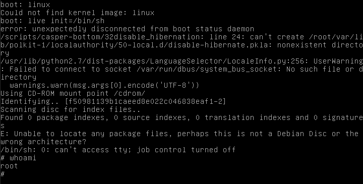

# Solution 2

Pour cette seconde solution, nous allons exploiter le fait que nous controlons le démarrage de l'ISO.

En effet, pour tout système `linux`, il est possible de lancer au démarrage un `boot menu` ou `recovery mode` ou autre.

Dans notre cas, il faut maintenir la touche `shift` au démarrage de notre VM, ce qui nous lance un terminal `boot`.

Grâce à [ce lien](https://askubuntu.com/questions/15284/how-to-boot-to-root-shell-when-grub-recovery-menu-fails-to-load-a-shell), nous savons quels paramètres entrer pour obtenir nos droits root.

Vu que nous démarrons la VM grâce à un iso, notre `boot option` sera `live`. Nous changons donc son initialisation par `/bin/sh` pour obtenir notre shell `root`.
